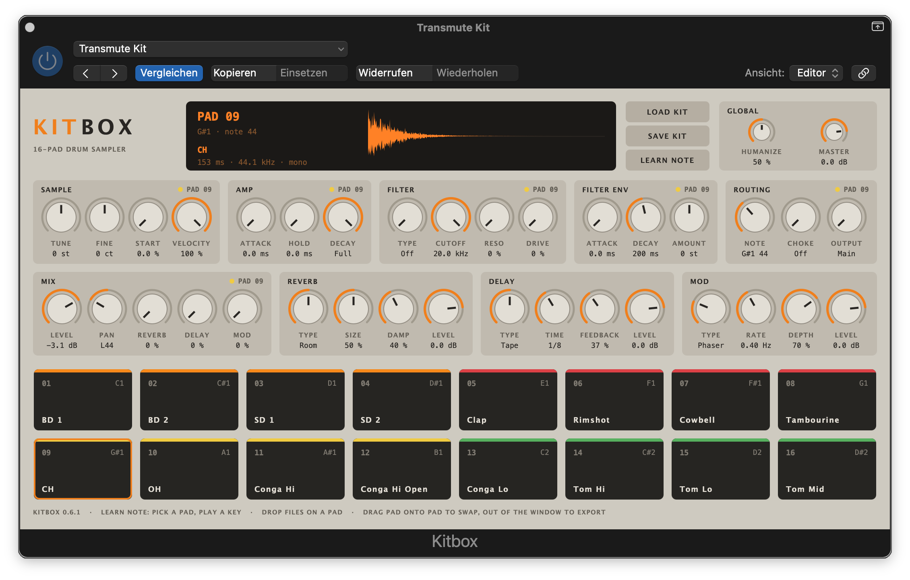

# Kitbox

A 16-pad drum sampler for macOS - AU (aumu/Ktbx/Tzor), VST3 and a standalone app, built with JUCE 9.

Its sibling [Transmute](https://github.com/TZorr/Transmute) rebuilds recorded
drum hits as clean synth voices and hands a whole kit over in one step:
**Export Kitbox Kit…** writes every drum onto its own Kitbox pad, with pan and
notes. The demo kit below was made that way.

## Install

Download `Kitbox.0.6.1.pkg` from
[Releases](https://github.com/TZorr/Kitbox/releases) and run it; choose AU,
VST3 or both - they go into `/Library/Audio/Plug-Ins`. Apple Silicon, macOS
26.5 or later. The installer is unsigned, so Gatekeeper refuses it at first:
right-click it and choose Open, or allow it under System Settings › Privacy &
Security.

**Demo kit:** [`Kits/Transmute Kit.aupreset`](Kits/Transmute%20Kit.aupreset)
(also attached to the release) - sixteen drums made with
[Transmute](https://github.com/TZorr/Transmute). Open it with **Load Kit**,
or put it in `~/Music/Audio Music Apps/Plug-In Settings/Kitbox/` and Logic's
settings menu lists it.

## Signal path

    pad sample (summed to mono on load)
      -> pitch (Tune, Fine; resampled on the fly, 4-point Hermite)
      -> filter: TPT state-variable, LP 12/24, BP, HP 12/24, with Drive and
         a saturating resonance; filter envelope (Attack, Decay, Amount)
      -> amp envelope (Attack, Hold, Decay; Decay "Full" = play the sample out)
      -> Level / Pan (equal power)  -> stereo mix
      -> Reverb / Delay / Mod sends (mono, post-level, pre-pan)

    Three send slots with Rackbox's effects (copied into Source/Engine/Fx),
    each knob-selectable by Type; a mono send enters as a centred stereo
    signal and returns in stereo:

    Reverb   Plate / Room / Hall                     Size, Damp
    Delay    Digital / Tape / Ping-Pong, tempo-synced Time (note value), Feedback
    Mod      Chorus / Phaser / Flanger / Tremolo     Rate, Depth
             Shifter (frequency shifter, 0.3.0)      Shift, Feedback

    Switching Type crossfades over 30 ms. Kits saved before 0.2.0 are
    translated on load (Source/Engine/FxMigration.h).

64 voices, 48 sounding; a stolen voice fades over 2 ms. Hits are one-shots and
sample-accurate.

## Routing (per pad)

- **Note** - any MIDI note; default 36-51 (C1-D#2). Several pads on one note
  play together (layering). **Learn Note**: select a pad, press the button,
  play a key.
- **Choke** - groups 1-8. A hit fades every voice in its group over 5 ms, the
  pad's own included (an open hat chokes itself). Pads layered on one note in
  the same group do not choke each other.
- **Output** - Main or Out 1-16. The plugin has sixteen stereo aux outputs,
  off by default; use Logic's *Multi Output* variant (or enable outputs in
  your DAW). A pad routed to an output that is not enabled plays on Main.
  Effect returns always go to Main; Master scales every output.

Dragging one pad onto another swaps sample, knobs, choke and output - the
note stays with the pad's place.

**Humanize** (0-100 %, 50 % at start) varies every hit by up to pitch +-6 ct,
filter +-10 %, level +-2 dB, start +-1 ms and pan +-4 % at 100 %; 50 % is what
100 % was before 0.6.0 (+-3 ct, 5 %, 1 dB, 0.5 ms, 2 %), and kits and sessions
saved before then load with their Humanize halved, so they sound as they did.

## Pads

- Click to play (higher on the pad = louder), right-click to load, rename or clear.
- **Rename...** renames the pad's sample: the name is saved with the kit and
  the session, moves with the pad when it is swapped, and is the file name a
  drag out of the pad hands over (the extension stays).
- Drop audio files on a pad; several files fill the following pads in name order.
- Drag a pad onto another to swap them (sample and knobs).
- Drag a pad out of the window to hand its original file to the Finder or a DAW.

## Kits

**Save Kit / Load Kit** write and read Audio Unit presets (`.aupreset`) - the
same kind of file Logic saves for an AU setting. The dialogs open in
`/Library/Audio/Presets/Kitbox/`. That folder is root's, so it is created once by
hand:

    sudo mkdir -p /Library/Audio/Presets/Kitbox
    sudo chown "$USER" /Library/Audio/Presets/Kitbox

Until it exists, they open in Logic's settings folder for Kitbox,
`~/Music/Audio Music Apps/Plug-In Settings/Kitbox/`. The preset is named after the file, without extension, and that
name is what Logic shows. Inside, under `jucePluginState`, is the Kitbox
container: every pad's original sample file plus all settings, gzip-compressed.
The DAW session stores the same container, so a project never depends on where
the samples were. Bare `.kitbox` files from earlier builds still load.

## Building

    Scripts/build.sh     # Release build + KitboxCheck + EditorShot (panel PNG in build/shots)
    Scripts/install.sh   # installs to ~/Library/Audio/Plug-Ins, runs auval
    Scripts/package.sh   # build + checks, then the AU/VST3 installer in build/

JUCE is expected at `~/JUCE`. No AUv3 on purpose - see the note in `CMakeLists.txt`.

## Licence

Kitbox is © 2026 T'Zorr and is distributed under AGPLv3 - see
[LICENSE](LICENSE). This follows from linking JUCE's free tier, which is
AGPLv3 itself; details in [THIRD_PARTY_NOTICES.md](THIRD_PARTY_NOTICES.md).

## Contact

T'Zorr - <TZorr@gmx.de>
